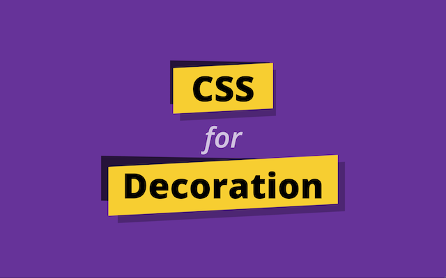

# CSS for Decoration

Slides for my talk at _[infoShare 2016](https://infoshare.pl/)_ in Gdańsk, Poland.

This is a custom interactive slide deck meant to be shown in a controlled environment on stage. It works as expected in Google Chrome and offers reasonable fallbacks to keep content readable, but not all demos may work well in other browsers.

[Live Demo](https://oslego.github.io/infoshare-2016)

